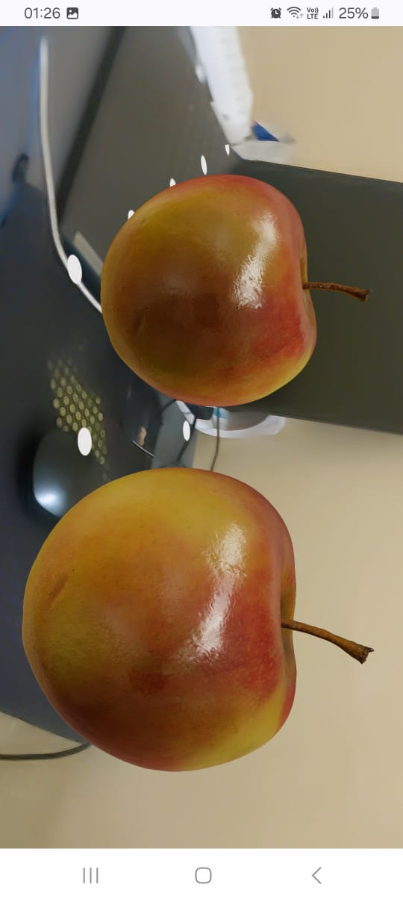
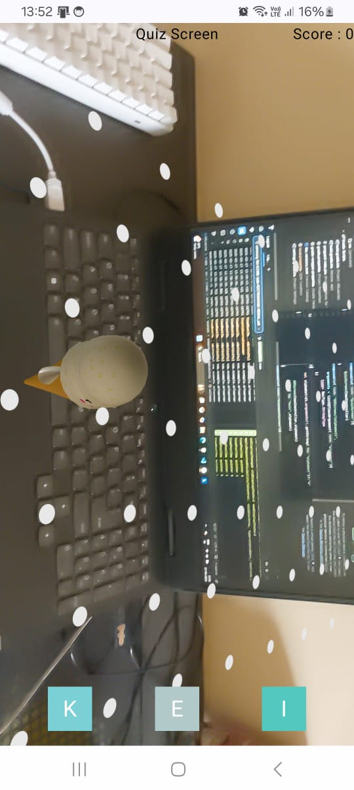
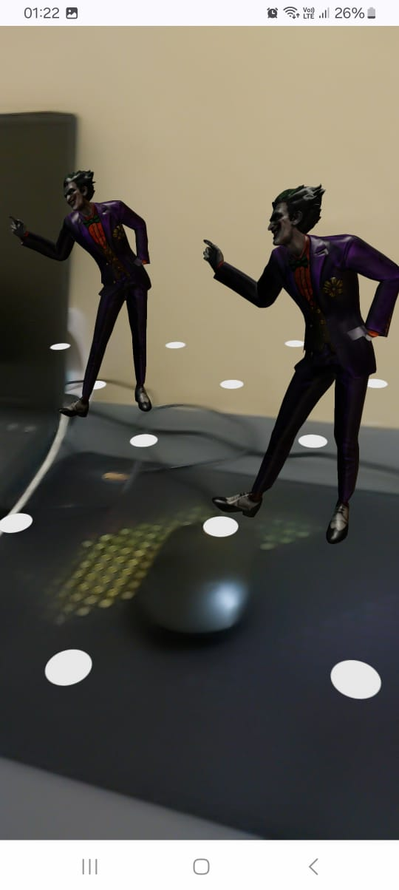

# **ARLearner** 🎓📚

### **An interactive Android app that uses Augmented Reality (AR) to visualize 3D objects for learning alphabets and play a quiz based on object recognition.**

---

## **🚀 Features**
✔ **AR Alphabet Learning** – Select an alphabet and place the corresponding 3D object in an AR scene.<br>
✔ **Quiz Mode** – Identify the correct starting alphabet for a randomly displayed 3D object.<br>
✔ **Jetpack Compose UI** – A modern and interactive UI.<br>
✔ **SceneView AR** – Integrated AR using `ARSceneView`.<br>
✔ **Gesture Controls** – Tap on a surface to place 3D objects dynamically.<br>
✔ **Optimized Object Management** – Ensures smooth AR interactions and memory management.<br>

---

## **📸 Screenshots**
<p align="center">
   
   
   
</p>

---

## **📦 Installation**

1️⃣ **Clone the repository**<br>
```bash
git clone https://github.com/your-username/ARLearner.git
```
2️⃣ **Open in Android Studio**<br>
3️⃣ **Build & Run on an AR-supported device**<br>

---

## **📄 App Structure & Implementation**
### **1️⃣ Alphabet Selection Screen**
📌 Displays a **grid of alphabets**. Selecting an alphabet navigates to the AR scene.<br>
📌 Uses **Jetpack Compose** for the UI.<br>

### **2️⃣ AR Scene (ARScreen.kt)**
📌 Initializes the **AR environment** using `rememberEngine()`.<br>
📌 Loads the 3D models dynamically based on selected alphabet.<br>
📌 **Tap gesture** to place models using `onSingleTapConfirmed`.<br>
📌 **Removes models & clears memory** on exit.<br>

### **3️⃣ Quiz Mode (QuizScreen.kt)**
📌 Displays a **random 3D object in AR**.<br>
📌 Users must **select the correct starting alphabet**.<br>
📌 If correct, a new object is loaded and the score is updated.<br>
📌 Previous objects are removed before new ones appear.<br>

---

## **⚠️ Caution**
- **Rendering the plane (white dots) may take 2 to 5 minutes**, so please be patient after selecting an alphabet or starting the quiz.
- **Some models may fail to load** due to size constraints or exceeding the **256-bone limit** of `ARSceneView`.

---

<h2 align="center">⭐ Like this project? Give it a star! 🌟</h2>
<h3 align="center">If you found this project helpful, consider giving it a ⭐ on GitHub! 🚀</h3>

# ARLearner
